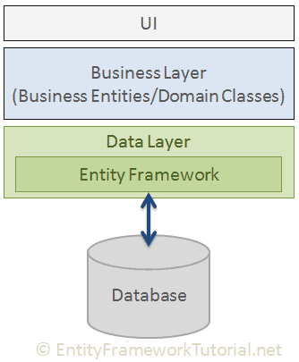
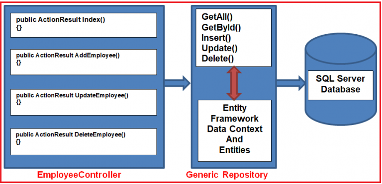
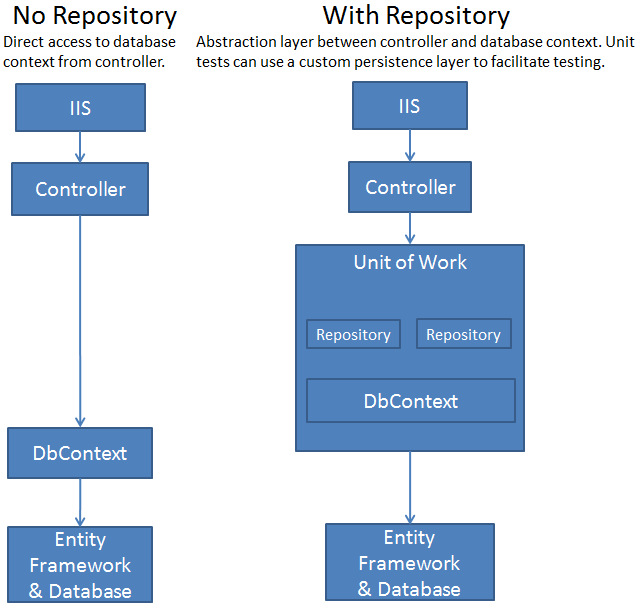
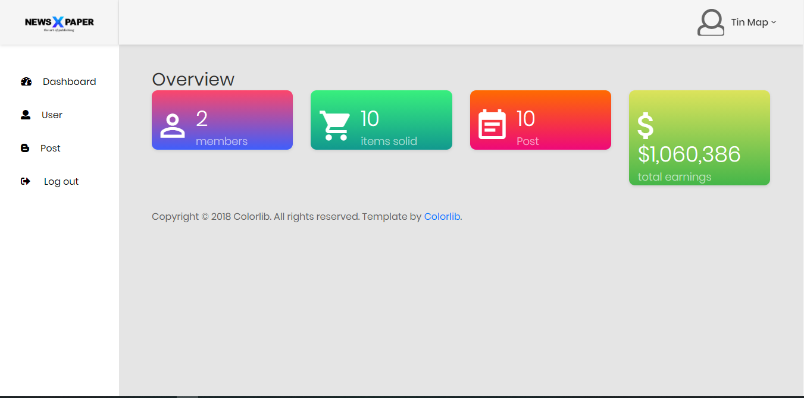
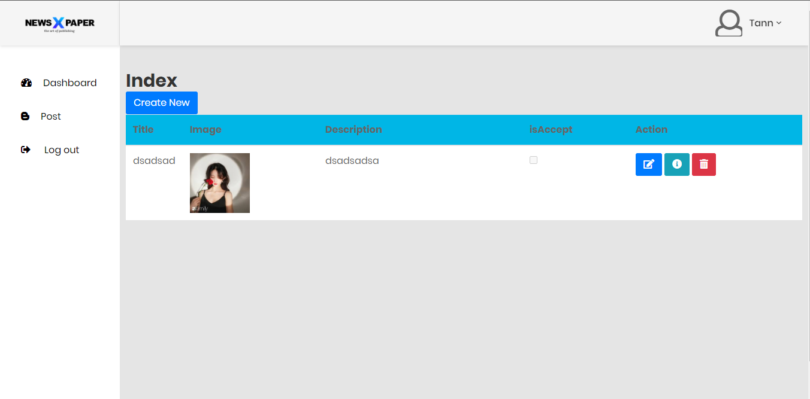
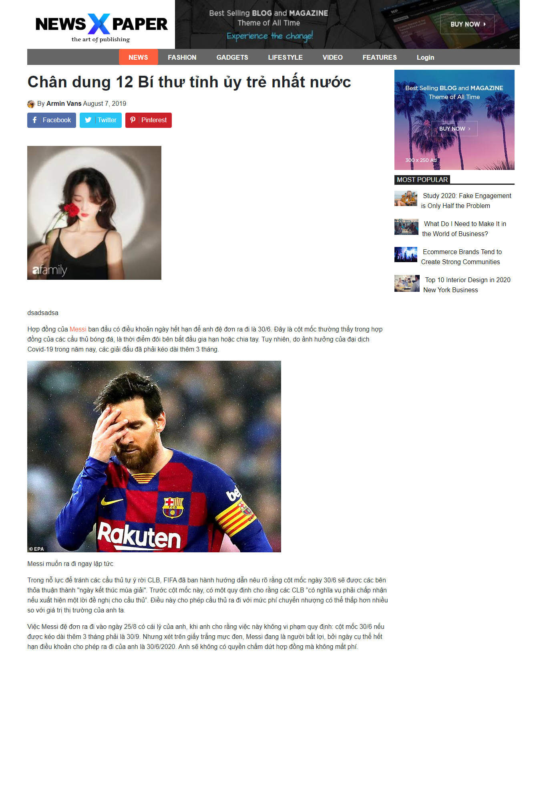

# App-Management News
Build a web application for management news.
<br />
## Table of contents
* [Introduce application](#intro)
* [Theoretical basis](#theoretical-basis)
  * [Entity framework](#entity)
  * [Repository pattern](#repo)
  * [Unit of work](#unit)
* [Usage](#usage)
  * [Template home](#home)
  * [User](#user)
  * [Admin](#admin)
* [Reference](#referenct)
<br />

## Introduce application <a name="intro"></a>
  <a></a>
- This project support manage the news in page and user join page and post news.
<br />

## Theoretical basis <a name="theoretical-basis"></a>

### Entity framework <a name="entity"></a>
 <a></a>
 - Entity Framework is an open-source ORM framework for .NET applications supported by Microsoft. It enables developers to work with data using objects of domain specific classes without focusing on the underlying database tables and columns where this data is stored. With the Entity Framework, developers can work at a higher level of abstraction when they deal with data, and can create and maintain data-oriented applications with less code compared with traditional applications.
 - Have three way create model in entity framework: model first, code first, database first
### Repository <a name="repo"></a>
<a></a>
-  Repository pattern, it provides an abstraction of data, so that your application can work with a simple abstraction that has an interface approximating that of a collection. Adding, removing, updating, and selecting items from this collection is done through a series of straightforward methods, without the need to deal with database concerns like connections, commands, cursors, or readers. Using this pattern can help achieve loose coupling and can keep domain objects persistence ignorant.
### Unit of work <a name="unit"></a>
<a></a>
- UoW is to store all Repositories and ensure that those Repositories share a single DbContext, thereby creating transactions - all database update operations by Repositories in the same business action will either be successful or fail. in order to ensure the consistent of data.
### Usage <a name="usage"></a>
- First step: clone source code 
```sh
git clone https://github.com/nhattan1504/App-Management
```
- Second step: install microsoft entity framework and Microsoft.AspNet.Mvc,cloudscribe.Pagination.Model and cloudscribe.Web.Pagination.
- Third step: install sql server and run application.
#### Template home <a name="home"></a>
<a></a>

#### Template admin <a name="admin"></a>
<a></a>
- Help admin manage user create post and user use app.
#### Template user <a name="user"></a>
<a></a>
- Help user create post
#### Detail 
<a></a>

## Reference <a name="referenct"></a>
[Repository Và Unit Of Work](https://c-sharp.vn/entity-framework/repository-va-unit-of-work-c36aeb)<br />
[EF and MVC tutorial](https://docs.microsoft.com/en-us/aspnet/core/data/ef-mvc/intro?view=aspnetcore-3.1)<br />
